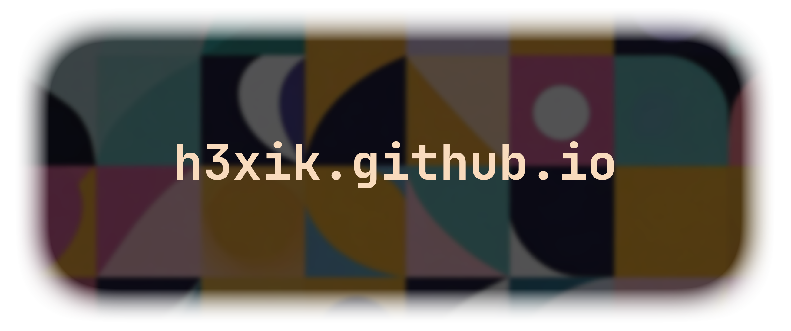
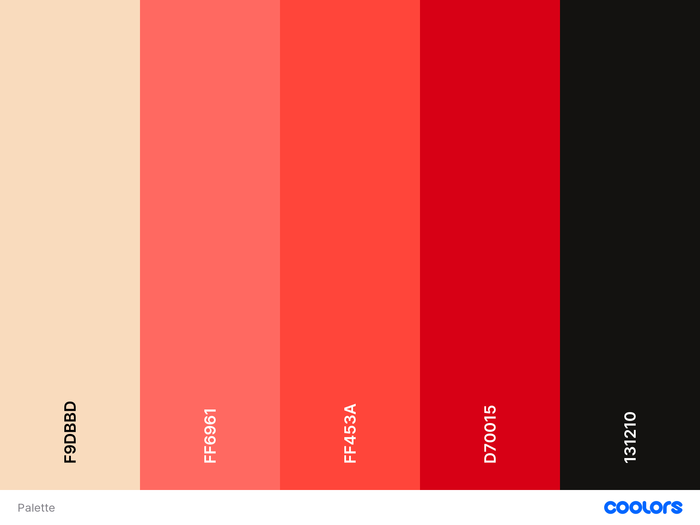

<p align="center"><a href="https://h3xik.github.io"></a></p>

[](https://app.netlify.com/sites/h3xik/deploys)

### Made with:
- Vue 3
- HTML, SCSS
- GSAP
- Adobe Photoshop, Illustrator & Firefly

### Color palette
<p><a href="https://h3xik.github.io"></a></p>

### CLI Cheatsheet

```bash
-> Run dev server:
run-p dev sass 

-> Run build & preview:
run-s stylelint sass-compile build preview
```